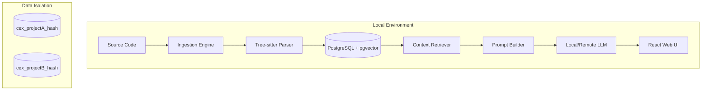

# cex — Code EXplainer

A local-first tool for understanding public (or private) code repositories.  
It ingests a repo into PostgreSQL, generates vector embeddings, and uses a local LLM to explain any symbol, file, or concept on demand.

## Features

- **Explain** — ask about any function, class, file, or free-text query
- **Embed** — semantic vector index (pgvector) for similarity search
- **Ingest** — tree-sitter AST parser that extracts symbols, call graphs, and imports

## Requirements

- Python 3.12+
- Docker (for PostgreSQL + pgvector)
- [`uv`](https://github.com/astral-sh/uv) — Python environment manager
- An OpenAI-compatible LLM server (Ollama, LocalAI, llama.cpp, etc.)

## Quick Start

### 1. Start Service Infrastructure
```bash
docker compose up -d   # Start PostgreSQL + pgvector
uv sync                # Install dependencies
```

### 2. Run the Platform
```bash
# Start the backend server and Web UI
uv run python main.py server
```
Once the server is running, open **http://localhost:8000** in your browser to begin onboarding.

---

## Logical Architecture

The diagram below illustrates the flow from source code ingestion to interactive explanation.



### Data Flow
1. **Dynamic Routing**: Every repository is assigned a unique database (e.g., `cex_schedule_af321b`). This ensures zero crosstalk between projects.
2. **Context Retrieval**: When you ask for an explanation, the retriever pulls the symbol's code, its **callers**, **callees**, and **file overview** into a high-context prompt.
3. **Caching**: Recommendations and explanations are cached per-project in both the database and `data/` directory JSON files for instant subsequent access.

---

## Configuration

Edit `config.toml` before running:

```toml
[database]
host     = "localhost"
name     = "cex"
user     = "postgres"
password = "postgres"

# Chat/completion model — any OpenAI-compatible server
[llm]
base_url    = "http://localhost:11434/v1"
model       = "qwen2.5-coder:7b"
api_key     = "ollama"
max_tokens  = 2048
temperature = 0.1

# Embedding model — can differ from the chat model
[embed]
model      = "nomic-embed-text"
dim        = 768    # must match the chosen model's output dimension
batch_size = 32
```

> **Note:** If you change `embed.dim`, run `cex reset` to recreate the schema  
> with the new `VECTOR(N)` column before re-embedding.

## Command Line Usage (Advanced)

While the Web UI is recommended, you can perform all actions via CLI:

| Command | Description |
|---------|-------------|
| `setup` | Create the database and apply the schema idempotently |
| `reset` | Drop and recreate the database (deletes all data) |
| `ingest <repo_dir>` | Parse a repository and populate the database |
| `server` | Launch the FastAPI backend and serve the Web UI |
| `embed [--force]` | Generate vector embeddings for all symbols |
| `build [target] [--fresh]` | Pre-generate and cache LLM explanations silently |
| `explain <target>` | Show explanation for a symbol (generates on demand if not cached) |

### `ingest` options

- `--db-host`, `--db-name`, `--db-user`, `--db-password` — override config values

### `embed` options

- `--force` — re-embed all symbols even if embeddings already exist

### `build` options

- `target` — file path, qualified name (`Job.run`), or free-text query (omit to build all symbols)
- `--fresh` — regenerate even if an explanation is already cached

### `explain` options

- `target` — file path, qualified name, or natural-language query; generates on-demand if not in cache

## Architecture

```
config.toml
    └── AppConfig
            ├── DBConfig    → PostgreSQL connection
            ├── LLMConfig   → chat model settings
            └── EmbedConfig → embedding model settings

main.py (CLI)
    ├── setup / reset  → setup_db.py     (schema DDL)
    ├── ingest         → ingestion/      (tree-sitter + DB writes)
    ├── embed          → search/         (LLM embed → pgvector)
    └── explain        → explain/        (retriever + LLM chat)
```

### Ingestion pipeline (`cex ingest`)

1. **Manifests** — scans `requirements.txt` / `pyproject.toml` for dependencies
2. **Files** — discovers source files matching registered language specs
3. **Symbols** — single tree-sitter walk per file, extracting:
   - Symbols: classes, functions, endpoints, ORM models
   - Relations: `NESTED_IN` (structure), `CALLS` (intra-file call graph)
   - Imports: module-level `import` and `from … import` statements

Test files and test directories are excluded from indexing.

### Database schema

| Table | Key | Purpose |
|-------|-----|---------|
| `files` | relative path | source files |
| `symbols` | qualified name | extracted code units + `VECTOR(N)` embedding column |
| `relations` | `src::type::tgt` | directed symbol graph |
| `repo_info` | root path | per-repository metadata |
| `dependencies` | `manifest::name` | declared package dependencies |
| `file_imports` | `file::module` | module import statements |
| `explanations` | qualified name | cached LLM explanations |

All primary keys are human-readable TEXT — no UUIDs.

### Explain pipeline (`cex build` / `cex explain`)

**`cex build`** (offline, batch):
1. **Resolve target** — file path → top-level symbols; exact qname → one symbol; free text → semantic/keyword search
2. **Context** — fetch parent, callers, callees (signatures only)
3. **LLM** — structured prompt, output suppressed; only progress printed
4. **Cache** — result written to `explanations` table

**`cex explain <target>`** (interactive):
1. Resolve target (same logic)
2. DB lookup — if cached, stream text to stdout immediately
3. If not cached — call LLM with streaming, cache result, display

## Documentation

- [`docs/schema.md`](docs/schema.md) — Multi-repo database schema reference
- [`docs/ingestion.md`](docs/ingestion.md) — Tree-sitter AST extraction logic
- [`docs/llm.md`](docs/llm.md) — Prompt engineering for code architecture
- [`docs/search.md`](docs/search.md) — embeddings and retriever
- [`docs/explain.md`](docs/explain.md) — explainer engine and caching
